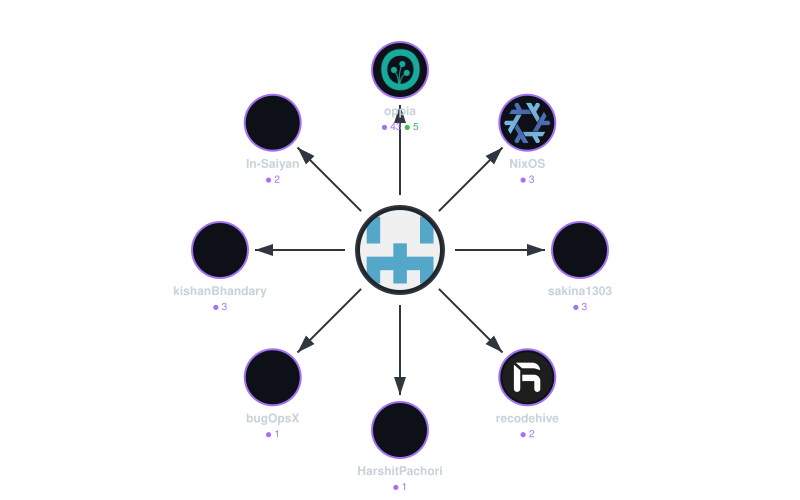

# MergeStation

> Automatically tracks open-source pull request contributions across multiple repositories and generates a visual contribution graph.

## 📊 Contribution Graph

<p align="center">
  
</p>

<p align="center">
  <strong>🟣 Merged</strong> &nbsp;|&nbsp; <strong>🟢 Open</strong>
</p>

---

## 🚀 How It Works

MergeStation uses the **GitHub GraphQL API** to fetch all pull requests created by a user across any repository on GitHub. It then:

1. **Collects** PR data using cursor-based pagination (fetches ALL PRs, not just the first 100)
2. **Aggregates** stats by organization — counting Merged, Open, and Closed PRs
3. **Generates** a hub-and-spoke SVG visualization showing your contribution network
4. **Automates** daily updates via GitHub Actions

### Architecture

```
┌─────────────────┐     ┌──────────────────┐     ┌─────────────────────┐
│   GitHub API     │────▶│  fetch_stats.py  │────▶│   charts/data.json  │
│   (GraphQL)      │     │  (Data Fetcher)  │     │   (PR Statistics)   │
└─────────────────┘     └──────────────────┘     └─────────┬───────────┘
                                                           │
                                                           ▼
                        ┌──────────────────┐     ┌─────────────────────────┐
                        │ generate_chart.py│────▶│ charts/contribution_    │
                        │ (SVG Generator)  │     │         graph.svg       │
                        └──────────────────┘     └─────────────────────────┘
```

### Tech Stack

- **Language**: Python 3.11
- **API**: GitHub GraphQL API v4
- **Visualization**: SVG (generated programmatically)
- **Automation**: GitHub Actions (cron schedule)
- **Auth**: GitHub Personal Access Token / `GITHUB_TOKEN`

---

## 🛠 Setup

### 1. Clone the Repository

```bash
git clone https://github.com/Sandesh282/MergeStation.git
cd MergeStation
```

### 2. Install Dependencies

```bash
pip install -r requirements.txt
```

### 3. Configure

Edit `config.json` to customize:

```json
{
  "username": "Sandesh282",
  "excluded_orgs": ["Sandesh282", "firstcontributions"],
  "max_orgs": 8,
  "output_dir": "charts"
}
```

| Field | Description |
|-------|-------------|
| `username` | Your GitHub username |
| `excluded_orgs` | Organizations to exclude from the chart |
| `max_orgs` | Maximum number of orgs to display |
| `output_dir` | Directory for output files |

### 4. Run Locally

```bash
export GITHUB_TOKEN="your_personal_access_token"
python scripts/fetch_stats.py
python scripts/generate_chart.py
```

### 5. GitHub Actions (Automatic)

The workflow runs daily at **2:00 AM UTC** and uses the built-in `GITHUB_TOKEN`. To trigger manually:

1. Go to **Actions** tab in your repository
2. Select **Update Contribution Graph**
3. Click **Run workflow**

---

## 📁 Project Structure

```
MergeStation/
├── .github/workflows/
│   └── update.yml              # Automated daily workflow
├── charts/
│   ├── data.json               # PR statistics (auto-generated)
│   └── contribution_graph.svg  # Visualization (auto-generated)
├── scripts/
│   ├── fetch_stats.py          # Data collection script
│   └── generate_chart.py       # SVG generation script
├── config.json                 # Project configuration
├── requirements.txt            # Python dependencies
├── .gitignore
└── README.md
```

---

## 📈 Features

- ✅ Full pagination — fetches ALL pull requests, not just the first 100
- ✅ Retry logic with exponential backoff for rate limiting
- ✅ Configurable org exclusion list
- ✅ Hub-and-spoke SVG visualization with GitHub avatars
- ✅ Automated daily updates via GitHub Actions
- ✅ Color-coded stats (🟣 Merged, 🟢 Open)

---

## 📜 License

This project is open source and available under the [MIT License](LICENSE).
