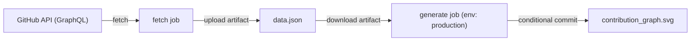

# MergeStation

> Automatically tracks open-source pull request contributions across multiple repositories and generates a visual contribution graph.

## Contribution Graph

<p align="center">
  
</p>

<p align="center">
  <strong>🟣 Merged</strong> &nbsp;|&nbsp; <strong>🟢 Open</strong>
</p>

---

## How It Works

MergeStation uses the **GitHub GraphQL API** to fetch all pull requests created by a user across any repository on GitHub. It then:

1. **Collects** PR data using cursor-based pagination (fetches ALL PRs, not just the first 100)
2. **Aggregates** stats by organization — counting Merged, Open, and Closed PRs
3. **Generates** a hub-and-spoke SVG visualization showing your contribution network
4. **Automates** daily updates via GitHub Actions

### Architecture

The workflow is split into two jobs with artifact passing:



### Tech Stack

- **Language**: Python 3.11
- **API**: GitHub GraphQL API v4
- **Visualization**: SVG (generated programmatically)
- **Automation**: GitHub Actions (cron + manual dispatch)
- **Auth**: `GITHUB_TOKEN` (built-in)

---

## Workflows

### Update Contribution Graph (`update.yml`)

The main workflow that fetches PR data and generates the contribution graph.

**Triggers:**
- Daily cron schedule at 2:00 AM UTC
- Manual dispatch with configurable inputs

**Workflow Dispatch Inputs:**

| Input | Type | Default | Description |
|-------|------|---------|-------------|
| `max_orgs` | string | `8` | Maximum number of organizations to display |
| `include_closed` | boolean | `false` | Include closed PRs in the chart |

These inputs are passed as environment variables (`MAX_ORGS`, `INCLUDE_CLOSED`) to the Python scripts, which fall back to `config.json` values when not set (so the cron trigger works without inputs).

**Two-Job Architecture:**

1. **`fetch` job** — Fetches PR data from GitHub GraphQL API, uploads `data.json` as an artifact
2. **`generate` job** — Downloads the artifact, generates the SVG chart, conditionally commits only if changes are detected

The `generate` job uses `environment: production`, demonstrating understanding of GitHub environment protections used in release pipelines.

**Conditional Commit Logic:**

The workflow detects whether the chart actually changed before committing:
- If changes are detected → commits and pushes
- If no changes → skips the commit and reports in the job summary

### Validate Configuration (`validate.yml`)

A validation workflow that runs on pull requests touching `config.json` or `scripts/`.

**Steps:**
1. Validates `config.json` schema — checks all required fields exist with correct types
2. Checks Python syntax — compiles both scripts to catch syntax errors
3. Dry-run API test — fetches 1 page of PR data to verify the API connection works, without writing `data.json`

---

## Setup

### 1. Clone the Repository

```bash
git clone https://github.com/Sandesh282/MergeStation.git
cd MergeStation
```

### 2. Install Dependencies

```bash
pip install -r requirements.txt
```

### 3. Configure

Edit `config.json` to customize:

```json
{
  "username": "Sandesh282",
  "excluded_orgs": ["Sandesh282", "firstcontributions"],
  "max_orgs": 8,
  "output_dir": "charts"
}
```

| Field | Description |
|-------|-------------|
| `username` | Your GitHub username |
| `excluded_orgs` | Organizations to exclude from the chart |
| `max_orgs` | Maximum number of orgs to display |
| `output_dir` | Directory for output files |

Environment variables `MAX_ORGS` and `INCLUDE_CLOSED` can override config values at runtime.

### 4. Run Locally

```bash
export GITHUB_TOKEN="your_personal_access_token"
python scripts/fetch_stats.py
python scripts/generate_chart.py
```

### 5. GitHub Actions (Automatic)

The workflow runs daily at **2:00 AM UTC** and uses the built-in `GITHUB_TOKEN`. To trigger manually:

1. Go to **Actions** tab in your repository
2. Select **Update Contribution Graph**
3. Click **Run workflow**
4. Optionally configure `max_orgs` and `include_closed` inputs

---

## Project Structure

```
MergeStation/
├── .github/workflows/
│   ├── update.yml              # Main workflow (fetch → generate → commit)
│   └── validate.yml            # PR validation (config + syntax + dry-run)
├── charts/
│   ├── data.json               # PR statistics (auto-generated)
│   └── contribution_graph.svg  # Visualization (auto-generated)
├── scripts/
│   ├── fetch_stats.py          # Data collection (pagination + retry + dry-run)
│   └── generate_chart.py       # SVG generation script
├── config.json                 # Project configuration
├── requirements.txt            # Python dependencies
├── .gitignore
└── README.md
```

---

## Features

- Full pagination — fetches ALL pull requests, not just the first 100
- Retry logic with exponential backoff for rate limiting
- Configurable org exclusion list
- Hub-and-spoke SVG visualization with GitHub avatars
- Two-job workflow architecture with artifact passing
- Workflow dispatch inputs with env var overrides
- Conditional commits — only pushes when chart actually changes
- PR validation workflow with config schema checks and dry-run mode
- Environment protection on the generate job
- Color-coded stats (🟣 Merged,🟢 Open)
